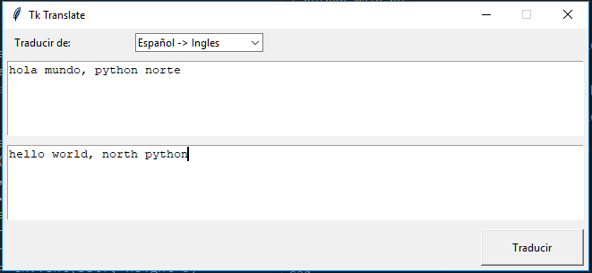

# TkTranslate

Pequeña herramienta para traducir usando el api de google, originalmente basado en el ejemplo publicado 
en el siguiente [articulo](http://www.pythondiario.com/2018/05/creacion-de-un-traductor-de-palabras.html).

## Requerimientos

### Windows

Sin requerimientos adicionales aparte de las librerias nativas de python.

### Linux/Ubuntu

requiere los paquetes adicionlas tk dependiendo la version de python en que corra

    $ sudo apt-get install python-tk python3-tk

## Python Requerimientos

Corre tanto en python 2.7.x como 3.5.x+ no requiere paquetes adicionales
